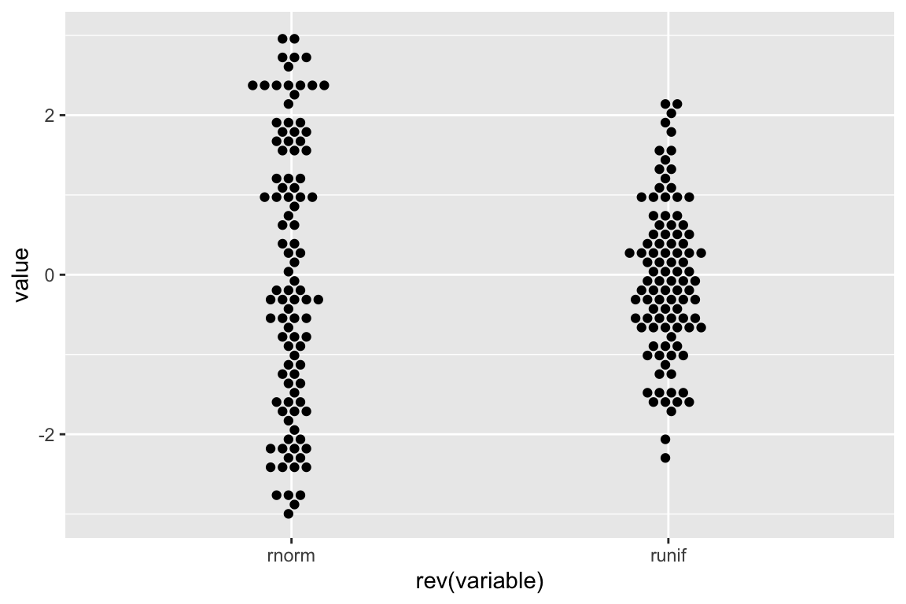

<!-- README.md is generated from README.Rmd. Please edit that file -->

# ggbeeswarm2: Beeswarm-style plots with ggplot2

<!-- badges: start -->

[](https://github.com/csdaw/ggbeeswarm2/actions)
[](https://codecov.io/gh/csdaw/ggbeeswarm2?branch=master)
<!-- badges: end -->

## Note

This is a fork of ggbeeswarm which is in a stable but unfinished state.
It will abandoned once the changes made here are implemented in
[ggbeeswarm](https://github.com/eclarke/ggbeeswarm)

The `position_beeswarm` function has been rewritten and is compatible
with R \>= v4.0.0. Additionally, `position_beeswarm` works almost
identically to the `beeswarm` function from the
[beeswarm](https://cran.r-project.org/web/packages/beeswarm/index.html)
package with all the additional methods implemented (including the new
`compactswarm`).

For example:

``` r
set.seed(123)
distro <- list(runif = runif(100, min = -3, max = 3), 
               rnorm = rnorm(100))

# beeswarm
beeswarm::beeswarm(distro, 
                   col = 2:3, pch = 16,
                   method = "hex",
                   main = "title")

# ggbeeswarm2
library(dplyr)
library(ggbeeswarm2)
```


``` r
distro2 <- as.data.frame(rev(distro)) %>% 
  tidyr::pivot_longer(
    everything(), 
    values_to = "value", 
    names_to = "variable"
    )

 ggplot2::ggplot(distro2, aes(x = rev(variable), y = value)) + 
   geom_beeswarm(method = "hex") + 
   scale_y_continuous(limits = c(-3, 3)) + 
   theme(
     plot.margin = unit(c(0.11, 0.07, 0.11, 0.07), "npc")
   )
```



------------------------------------------------------------------------

Author: Charlotte Dawson

Original authors: Erik Clarke and Scott Sherrill-Mix
